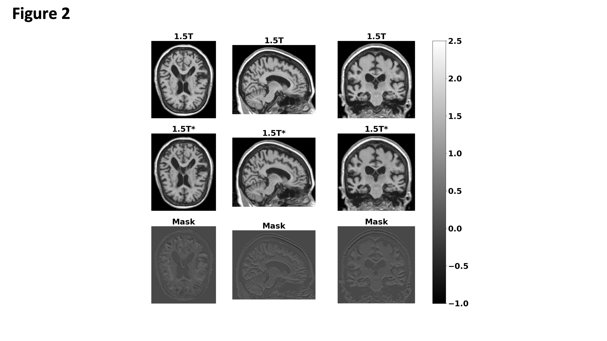
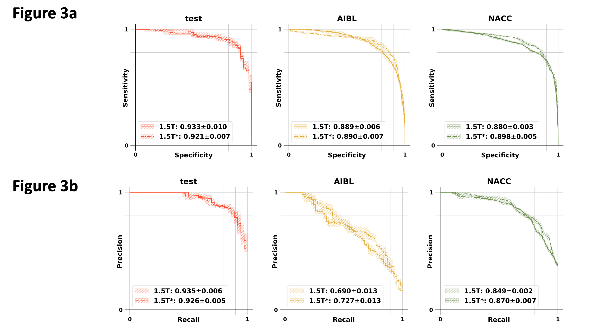

# Enhancing MR imaging driven Alzheimer’s disease classification performance using generative adversarial learning

## Introduction

This repo contains a PyTorch implementation of a deep learning framework that enhance Alzheimer’s disease (AD) classification performance using MRI scans of multiple magnetic field strengths, while also improve the image quality. The framework contains a generative adversarial network (GAN), a fully convolutional networks (FCN), and a multilayer perceptron. See below for the overall structure of our framework.


The modified GAN was developed on ADNI training and validation sets and its performance was evaluated on ADNI testing set and 2 external testing datasets, including NACC and AIBL datasets. See below for the results.




The MLP makes final global prediction on the diagnosis results. See below


The performance of the final global prediction from MLP model was compared with 11 neurologists. See below our FCN + MLP model roc curve.



Please refer to our paper for more details.

## How to use

These instructions will help you properly configure and use the tool.

### Data

We trained, validated and tested the framework using the Alzheimer's Disease Neuroimaging Initiative (ADNI) dataset. To investigate the generalizability of the framework, we externally tested the framework on the National Alzheimer's Coordinating Center (NACC) and the Australian Imaging Biomarkers and Lifestyle Study of Ageing (AIBL) datasets.

To download the raw data, please contact those affiliations directly. In "./lookupcsv/" folder, we provided csv table containing subjects details used in this study for each dataset. We also provided all data preprocessing manuscripts in "./Data_Preprocess/" folder. After data preprocssing, the data can be stored in the folder structure like below:

```
data_dir/ADNI/
data_dir/NACC/
data_dir/AIBL/
```

### Code dependencies

The tool was developped based on the following packages:

1. PyTorch (1.1 or greater).
2. NumPy (1.16 or greater).
3. matplotlib (3.0.3 or greater)
4. tqdm (4.31 or greater).
5. matlab
6. scipy

Please note that the dependencies may require Python 3.6 or greater. It is recommemded to install and maintain all packages by using [`conda`](https://www.anaconda.com/) or [`pip`](https://pypi.org/project/pip/). For the installation of GPU accelerated PyTorch, additional effort may be required. Please check the official websites of [PyTorch](https://pytorch.org/get-started/locally/) and [CUDA](https://developer.nvidia.com/cuda-downloads) for detailed instructions.

### Configuration file

The configuration file is a json file which allows you conveniently change hyperparameters of models used in this study.

```json
{

    "fcn":{
        "fil_num":              20,                # filter number of the first convolution layer in FCN
        "drop_rate":            0.5,
        "patch_size":           47,                # 47 has to be fixed, otherwise the FCN model has to change accordingly
        "batch_size":           10,
        "balanced":             1,                 # to solve data imbalance issue, we provdided two solution: set value to 0 (weighted cross entropy loss), set value to 1 (pytorch sampler samples data with probability according to the category)
        "Data_dir":             "/data_dir/ADNI/", # change the path according to you folder name
        "learning_rate":        0.0001,
        "train_epochs":         3000
    },
    "mlp": {
        "imbalan_ratio":        1.0,               # imbalanced weight in weighted corss entropy loss
        "fil_num":              100,               # first dense layer's output size
        "drop_rate":            0.5,
        "batch_size":           8,
        "balanced":             0,
        "roi_threshold":        0.6,
        "roi_count":            200,
        "choice":               "count",           # if choice == 'count', then select top #roi_count as ROI
                                                   # if choice == 'thres', then select value > roi_threshold as ROI
        "learning_rate":        0.01,
        "train_epochs":         300
    },

    ....
    ....

    "cnn": {
        "fil_num":              20,
        "drop_rate":            0.137,
        "batch_size":           2,
        "balanced":             0,
        "Data_dir":             "/data/datasets/ADNI_NoBack/",
        "learning_rate":        0.00001,
        "train_epochs":         200
    },
    "cnnp": {
        "fil_num":              20,
        "drop_rate":            0.137,
        "batch_size":           2,
        "balanced":             0,
        "Data_dir":             "./ADNIP_NoBack/",
        "learning_rate":        0.0001,
        "train_epochs":         200
    }
}
```

```json
{
    "G_lr": 0.0066112,
    "G_pth": "",
    "G_fil_num": 10,
    "warm_G_epoch": 5,
    "D_lr": 0.01,
    "D_pth": "",
    "D_fil_num": 17,
    "warm_D_epoch": 20,
    "epochs": 5555,
    "Data_dir": "/data/datasets/ADNI_NoBack/",
    "L1_norm_factor": 0.1,
    "AD_factor": 0.1,
    "batch_size_p": 10,
    "checkpoint_dir": "./checkpoint_dir/fcn_gan/",
    "drop_rate": 0.725430,
    "balanced": 0,
    "log_name": "fcn_gan_log.txt",
    "iqa_name": "iqa.txt",
    "save_every_epoch": 30,
    "D_G_ratio": 1
}
```

### Train, validate and test the network models

```
python main.py
```
Please modify main.py to train and test your own models, where:

'gan_main' corresponding to training & generating phase of the GAN model, where one may choose a specified epoch for the generator & FCN.
'fcn_main' corresponding to training & testing phase of the FCN model.
'mlp_main' corresponding to training & testing phase of the multilayer perceptron model.

Function 'fcn_main' and 'mlp_main' will do number of repeat time independent FCN model training and MLP model on random splitted data. Model performance is thus evaluated on all runs as mean +/- std.

```
DPMs/fcn_exp0/
DPMs/fcn_exp1/
...
DPMs/fcn_expN/
```

Model weights and predicted raw scores on each subjects will be saved in:

```
ckeckpoint_dir/fcn_exp0/
ckeckpoint_dir/fcn_exp1/
...
ckeckpoint_dir/fcn_expN/
```
