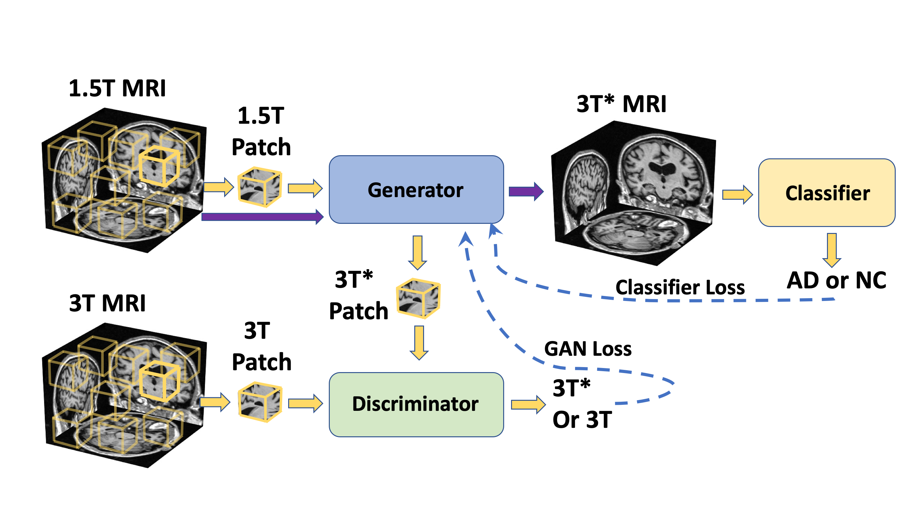
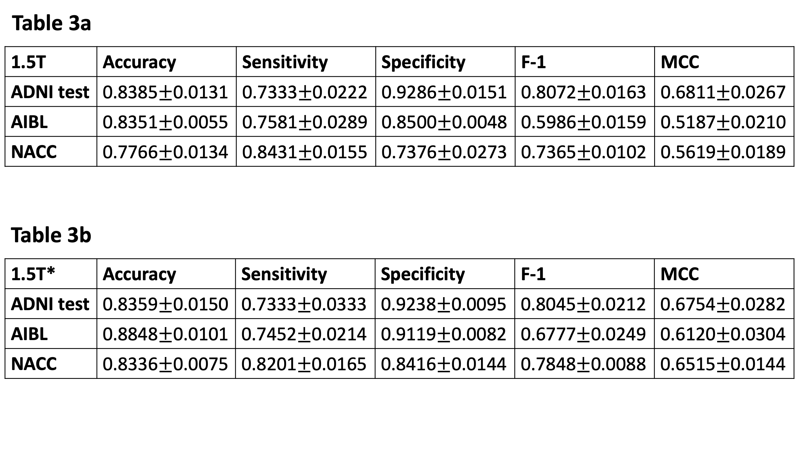
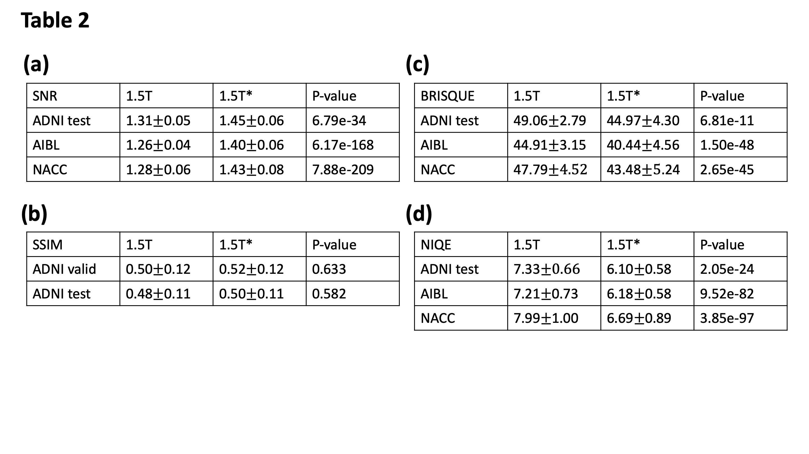

# Enhancing magnetic resonance imaging driven Alzheimer’s disease classification performance using generative adversarial learning

This work is published in _Alzheimer's Research & Therapy_. See here: https://doi.org/10.1186/s13195-021-00797-5

## Introduction

This repo contains a PyTorch implementation of a deep learning framework that enhance Alzheimer’s disease (AD) classification performance using MRI scans of multiple magnetic field strengths, while also improve the image quality. The framework contains a generative adversarial network (GAN), a disease classifier. See below for the overall structure of our framework. The generator will try to generate 3T\* images based on 1.5T input, while the discriminator will try to identify between the generated 3T\* images and the original 3T images. The disease classifier will be trained together with the GANs, using the 3T\* as input to predict the binary classification between NC (normal cognition) and AD.

<p align="center">

</p>

The modified GAN was developed on ADNI training and validation sets and its performance was evaluated on ADNI testing set and 2 external testing datasets (NACC and AIBL). See below for the results.

Disease classification performance:

<p align="center">
  
</p>

Image quality metrics:

<p align="center">

</p>


Please refer to our paper for more details.

## How to use

These instructions will help you properly configure and use the tool.

### Code dependencies

The tool was developped based on the following packages:

1. PyTorch (1.1 or later)
2. NumPy (1.16 or later)
3. matplotlib (3.0.3 or later)
4. tqdm (4.31 or later)
5. matlab (2018b or later)
6. scipy (1.4.1 or later)

Please note that the dependencies may require Python 3.6 or greater. It is recommemded to install and maintain all packages by using [`conda`](https://www.anaconda.com/) or [`pip`](https://pypi.org/project/pip/). For the installation of GPU accelerated PyTorch, additional effort may be required. Please check the official websites of [PyTorch](https://pytorch.org/get-started/locally/) and [CUDA](https://developer.nvidia.com/cuda-downloads) for detailed instructions.

### Data

We trained, validated and tested the framework using the Alzheimer's Disease Neuroimaging Initiative (ADNI) dataset. To investigate the generalizability of the framework, we externally tested the framework on the National Alzheimer's Coordinating Center (NACC) and the Australian Imaging Biomarkers and Lifestyle Study of Ageing (AIBL) datasets.

#### Preprocessing

* **step1: Linear registration using FSL FLIRT function** (need FSL to be installed).

    We provided this bash pipeline (Data_Preprocess/registration.sh) to perform this step. To run the registration.sh on a single case:
    ```
    bash registation.sh folder_of_raw_nifti/ filename.nii output_folder_for_processed_data/
    ```
    To register all data in a folder, you can use the python script (Data_Preprocess/registration.py) in which calls the registration.sh.
    ```
    python registration.py folder_of_raw_data/ folder_for_processed_data/
    ```

* **step2: convert nifit into numpy and perform z-score voxel normalization**

    "(scan-scan.mean())/scan.std()"        

* **step3: clip out the intensity outliers (voxel<-1 or voxel>2.5)**

    "np.clip(scan, -1, 2.5)"   

    To run step 2 and 3 together:
    ```
    python intensity_normalization_and_clip.py folder_for_step1_outcomes/
    ```

* **step4: background removal**

    Background signals outside the skull exist in the MRI. We set all background voxels with the same intensity (value=-1) to decrease the incluence of background signals. The general idea of doing background removal is using the Depth First Search with corners as starting points, then gradually filling out the searched background regions, until it reach outer bright sphere signals from skull fat. To run this step:

    ```
    python back_remove.py folder_for_prev_outcome_after_step123/ folder_for_final_output_of_step4/
    ```
    

In "./lookupcsv/" folder, we provided csv table containing subjects details used in this study for each dataset. After data preprocssing, the data can be stored in the folder structure like below:

```
data_dir/ADNI/
data_dir/NACC/
data_dir/AIBL/
```


### Configuration file

The configuration file is a json file which allows you conveniently change hyperparameters of models used in this study. For instance, you can change the "Data_dir" variable to specify your own data directory.

cnn_config.json
```json
{
    "fcn":{
        "fil_num":              20,
        "drop_rate":            0.5,
        "patch_size":           47,
        "batch_size":           10,
        "balanced":             1, 
        "Data_dir":             "/data_dir/ADNI/",
        "learning_rate":        0.0001,
        "train_epochs":         3000
    },
    "mlp": {
        "imbalan_ratio":        1.0,              
        "fil_num":              100,              
        "drop_rate":            0.5,
        "batch_size":           8,
        "balanced":             0,
        "roi_threshold":        0.6,
        "roi_count":            200,
        "choice":               "count",          
        "learning_rate":        0.01,
        "train_epochs":         300
    }
}
```

gan_config.json
```json
{
    "G_lr": 0.0066112,
    "G_pth": "",
    "G_fil_num": 10,
    "warm_G_epoch": 5,
    "D_lr": 0.01,
    "D_pth": "",
    "D_fil_num": 17,
    "warm_D_epoch": 20,
    "epochs": 5555,
    "Data_dir": "/data_dir/ADNI/",
    "L1_norm_factor": 0.1,
    "AD_factor": 0.1,
    "batch_size_p": 10,
    "checkpoint_dir": "./checkpoint_dir/fcn_gan/",
    "drop_rate": 0.725430,
    "balanced": 0,
    "log_name": "fcn_gan_log.txt",
    "iqa_name": "iqa.txt",
    "save_every_epoch": 30,
    "D_G_ratio": 1
}
```

### Train, validate and test the network models
To run the code in the original setting, simply follow the below commands:

```
python main.py
```

The disease probability maps will be stored in:

```
DPMs/fcn_exp*/
```

Model weights and predicted raw scores on each subjects will be saved in:

```
ckeckpoint_dir/fcn_exp*/
```
